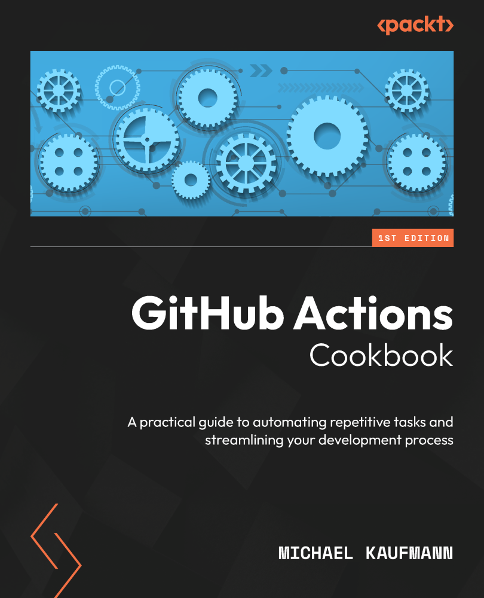

# GitHub Actions Cookbook

*A practical guide to automating repetitive tasks and streamlining your development process*

* 作者：Michael Kaufmann
* 译者：陈晓伟
* 出版于: 2024年4月

> [!IMPORTANT]
> 翻译是译者用自己的思想，换一种语言，对原作者想法的重新阐释。鉴于我的学识所限，误解和错译在所难免。如果你能买到本书的原版，且有能力阅读英文，请直接去读原文。因为与之相较，我的译文可能根本不值得一读。
>
> — 云风，程序员修炼之道第2版译者

## 本书概述

Say goodbye to tedious tasks! GitHub Actions is a powerful workflow engine that automates everything in the GitHub ecosystem, letting you focus on what matters most.

**关于本书**

Authored by a Microsoft Regional Director, this book shows you how to leverage the power of the community-driven GitHub Actions workflow platform to automate repetitive engineering tasks

This book explains the GitHub Actions workflow syntax, the different kinds of actions, and how GitHub-hosted and self-hosted workflow runners work. You'll get tips on how to author and debug GitHub Actions and workflows with Visual Studio Code (VS Code), run them locally, and leverage the power of GitHub Copilot. The book uses hands-on examples to walk you through real-world use cases that will help you automate the entire release process. You'll cover everything, from automating the generation of release notes to building and testing your software and deploying securely to Azure, Amazon Web Services (AWS), or Google Cloud using OpenID Connect (OIDC), secrets, variables, environments, and approval checks.

The book goes beyond CI/CD by demonstrating recipes to execute IssueOps and automate other repetitive tasks using the GitHub CLI, GitHub APIs and SDKs, and GitHub Token. You'll learn how to build your own actions and reusable workflows to share building blocks with the community or within your organization.

By the end of this GitHub book, you'll have gained the skills you need to automate tasks and work with remarkable efficiency and agility.

**主要特点**

* Automate CI/CD workflows and deploy securely to cloud providers like Azure, AWS, or GCP using OpenID
* Create your own custom actions with Docker, JavaScript programming, or shell scripts and share them with others
* Discover ways to automate complex scenarios beyond the basic ones documented in GitHub

**内容包括**

* Author and debug GitHub Actions workflows with VS Code and Copilot
* Run your workflows on GitHub-provided VMs (Linux, Windows, and macOS) or host your own runners in your infrastructure
* Understand how to secure your workflows with GitHub Actions
* Boost your productivity by automating workflows using GitHub's powerful tools, such as the CLI, APIs, SDKs, and access tokens
* Deploy to any cloud and platform in a secure and reliable way with staged or ring-based deployments

**适读人群**

This book is for anyone looking for a practical approach to learning GitHub Actions, regardless of their experience level. Whether you're a software developer, a DevOps engineer, anyone who has already experimented with Actions, or someone completely new to CI/CD tools like Jenkins or Azure Pipelines, you'll find expert insights in this book. Basic knowledge of using Git and command lines is a must.

## 作者简介

Michael Kaufmann believes that developers and engineers can be happy and productive at work. He loves DevOps, GitHub, Azure, and modern work. Microsoft has awarded him with the title Microsoft Regional Director (RD) and Microsoft Most Valuable Professional (MVP) – the latter in the category of DevOps and GitHub. Michael is also the founder and managing director of Xebia Microsoft Services, Germany – a consulting company that helps its customers become digital leaders by supporting them in their cloud, DevOps, and digital transformation. Michael shares his knowledge in books, training, and as a frequent speaker at international conferences.

## 本书相关

* Github翻译地址：https://github.com/xiaoweiChen/GitHub-Actions-Cookbook

* 译文的LaTeX 环境配置：https://www.cnblogs.com/1625--H/p/11524968.html

  * 禁用拼写检查：https://blog.csdn.net/weixin_39278265/article/details/87931348

  * 使用xelatex编译时需要添加`-shell-escape`和`-8bit`选项，例如：

    `xelatex -synctex=1 -interaction=nonstopmode -shell-escape -8bit "book".tex`

  * 为了内容中表格和目录索引能正常生成，至少需要连续编译两次

  * Latex中的中文字体([思源宋体](https://github.com/notofonts/noto-cjk/releases))和英文字体([Hack](https://github.com/source-foundry/Hack-windows-installer/releases/tag/v1.6.0))，需要安装后自行配置。如何配置请参考主book/css.tex顶部关于字体的信息。

* vscode中配置LaTeX：https://blog.csdn.net/Ruins_LEE/article/details/123555016

